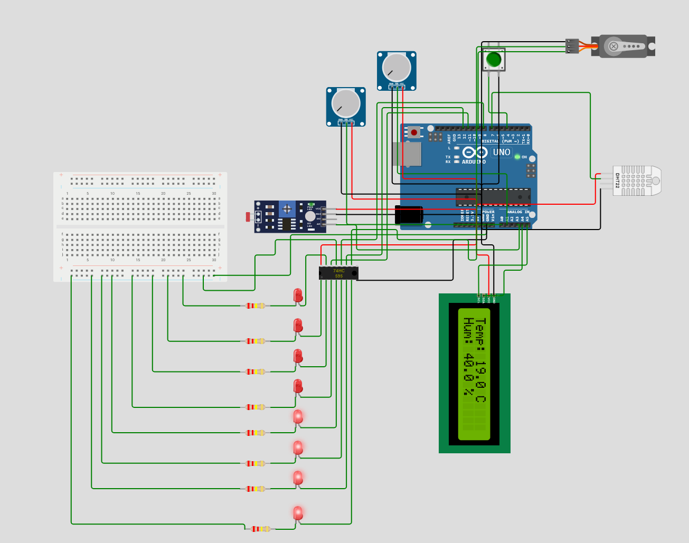

# Arduino: Sensor de Temperatura, Humedad y Luz

Actividad 1 de la asignatura Equipos e Instrumentación del Máster Universitario en Ingeniería de Telecomunicación de la UNIR.
El proyecto consiste en el desarrollo de una estación de monitoreo ambiental básica utilizando una placa Keyestudio Plus.
Utiliza una pantalla LCD con interfaz I2C para mostrar la temperatura, humedad y el nivel de luz ambiental, permitiendo cambiar la información visualizada mediante un botón físico.

---

## 🔧 Componentes

- Arduino keyestudio Plus
- Sensor DHT11 (temperatura y humedad)
- Fotorresistor (LDR)
- Resistencia de 10kΩ (divisor de tensión)
- Pantalla LCD 16x2 con interfaz I2C
- Botón
- Protoboard y cables de conexión

---

## 🛠️ Montaje

### Diagrama de conexiones (resumen)

| Componente | Pin Arduino |
|------------|-------------|
| DHT11      | D7          |
| LDR        | A3 |
| Botón      | D4 (con `INPUT_PULLUP`) |
| LCD I2C    | SDA: A4, SCL: A5 |

> ⚠️ El LDR se conecta formando un divisor de tensión con una resistencia de 10kΩ a GND.

### Esquema visual

A continuación, se muestra el diagrama de conexiones de esta práctica:

---

## 📋 Funcionamiento

- Al iniciar, se muestra en pantalla la **temperatura y humedad** medidas por el sensor DHT22.
- Al pulsar el botón, la pantalla alterna a la **lectura del nivel de luz** (valor analógico del LDR).
- Cada nueva pulsación cambia entre estas dos pantallas.

---

### Simulación en Wokwi

Haz clic en el siguiente [enlace](https://wokwi.com/projects/428151434350539777) para acceder a la simulación del circuito en la plataforma Wokwi.

---

### Demostración en vídeo

Puedes ver una demostración del funcionamiento del circuito físico haciendo clic en este [enlace](demo_video.mp4).

---

## 💾 Código fuente

El código utilizado en esta práctica se encuentra en la carpeta [code](/code/code.ino).  
El archivo `.ino` está comentado para facilitar su comprensión.
