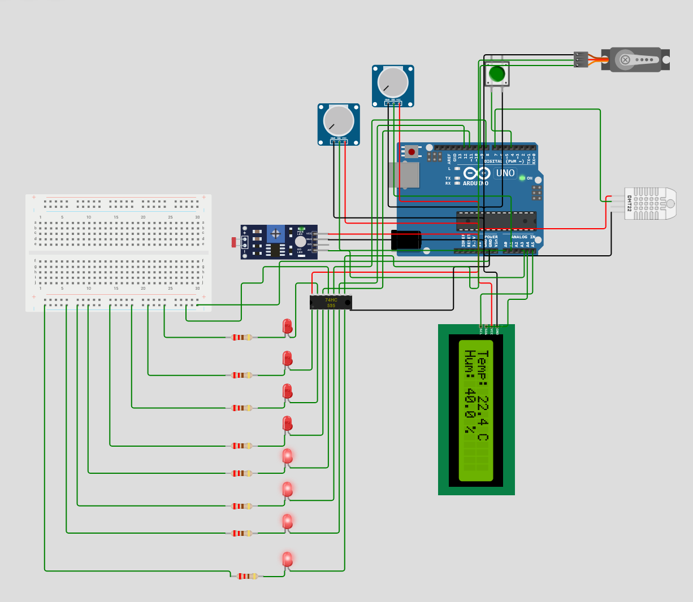

# Arduino: Sensor de Temperatura, Humedad y Luz

Actividad 1 de la asignatura Equipos e Instrumentación del Máster Universitario en Ingeniería de Telecomunicación de la UNIR.
El proyecto consiste en el desarrollo de una estación de monitoreo ambiental básica utilizando una placa Keyestudio Plus.
Utiliza una pantalla LCD con interfaz I2C para mostrar la temperatura, humedad, nivel de luz ambiental, velocidad del viento y calidad del aire, permitiendo cambiar la información visualizada mediante un botón físico.

---

## 🔧 Componentes

- Arduino keyestudio Plus
- Sensor DHT11 (temperatura y humedad)
- Fotorresistor (LDR)
- Resistencia de 10kΩ (divisor de tensión)
- Pantalla LCD 16x2 con interfaz I2C
- Botón
- 2 potenciómetros
- Protoboard y cables de conexión

---

## 🛠️ Montaje

### Diagrama de conexiones (resumen)

| Componente | Pin Arduino |
|------------|-------------|
| DHT11      | D7          |
| LDR        | A3          |
| POT1       | A0          |
| POT2       | A1          |
| Botón      | D4 (con `INPUT_PULLUP`) |
| LCD I2C    | SDA: A4, SCL: A5 |

> ⚠️ El LDR se conecta formando un divisor de tensión con una resistencia de 10kΩ a GND.

### Esquema visual

A continuación, se muestra el diagrama de conexiones de esta práctica:

---

## 📋 Funcionamiento

- Al iniciar, se muestra en pantalla la **temperatura y humedad** medidas por el sensor DHT22.
- Al pulsar el botón, la pantalla muestra el **nivel de luz ambiental**, basado en la lectura analógica del LDR normalizada a una escala de 0 a 100.
- Al pulsar el botón nuevamente, la pantalla muestra la **calidad del aire**, basado en la simulación que logramos con el potenciómetro.
- Al pulsar el botón nuevamente, la pantalla muestra la **velocidad del viento**, basado en la simulación que logramos con el potenciómetro.
- Cada nueva pulsación cambia entre estas pantallas.

---

### Simulación en Wokwi

Haz clic en el siguiente [enlace](https://wokwi.com/projects/428151434350539777) para acceder a la simulación del circuito en la plataforma Wokwi.
   
---

### Demostración en vídeo

Puedes ver una demostración del funcionamiento del circuito físico haciendo clic en este [enlace](demo_video.mp4).

> ⚠️ En la simulación de Wokwi se han utilizado dos potenciómetros para representar los sensores de velocidad del viento y calidad del aire. Debido a la falta de componentes físicos durante el desarrollo, estos sensores no han podido ser implementados en el prototipo real. Los potenciómetros permiten ajustar manualmente los valores de entrada y comprobar el funcionamiento del sistema.
>
>- Potenciómetro 1 (A0): Simula sensor de calidad del aire
>- Potenciómetro 2 (A1): Simula sensor de velocidad del viento

---

## 💾 Código fuente

El código utilizado en esta práctica se encuentra en la carpeta [code](/code/code.ino).  
El archivo `.ino` está comentado para facilitar su comprensión.
